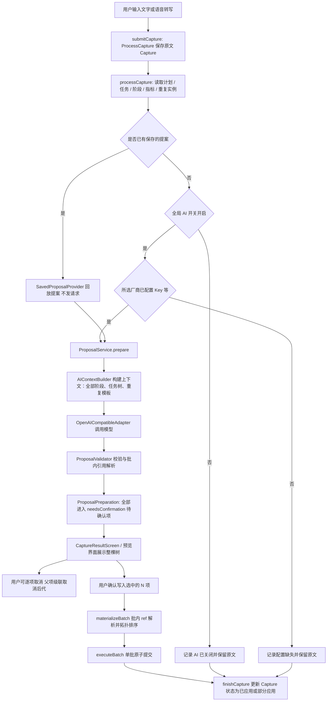

# AI 构建待办流程

本文描述「用户输入一段文字 → AI 整理 → 预览确认 → 写入待办」的实际实现，以源码为准。手动创建（`CreateTask`）不经过此流程；构建、调试命令见 [Development.md](Development.md)，产品语义见 [PRD.md](PRD.md)。

## 1. 核心原则

- **AI 只提议，不写库。** 模型输出 `AIProposal`，由本地 `ProposalValidator` 校验后产出预览结构树，经用户在界面确认后作为一个原子批次提交。
- **先预览后落盘。** 所有有效提议均先在界面预览，用户可逐项取消（取消父项级联取消后代）；确认后原子写入，失败整体回滚。
- **原文先落库。** 任何一步失败，`Capture` 原文都已保存，可在整理记录中重试或编辑文字。
- **原文原样发送。** 隐私只保留全局「AI 开关」，开启后输入原文原样发往模型；Key 仅存钥匙串，日志严格脱敏。
- **可回退限制。** 写入的批次支持整批回滚，限制为最近 N 步（默认 5 步，`Defaults.json` 配置），不覆盖较新修改。

## 2. 总览

关键入口：

| 环节 | 位置 |
| --- | --- |
| 输入、提交、重试、确认 | [Movo/App/AppEnvironment+Capture.swift](../Movo/App/AppEnvironment+Capture.swift) |
| 流水线编排 | [Movo/Intelligence/Planning/ProposalService.swift](../Movo/Intelligence/Planning/ProposalService.swift) |
| 上下文构建 | [Movo/Intelligence/Privacy/ContextBuilder.swift](../Movo/Intelligence/Privacy/ContextBuilder.swift) |
| 校验与物化 | [Movo/Intelligence/Planning/ProposalValidator.swift](../Movo/Intelligence/Planning/ProposalValidator.swift)、[ProposalMaterializer.swift](../Movo/Intelligence/Planning/ProposalMaterializer.swift) |
| 整理记录与预览 | [Movo/Features/Inbox/OrganizeHistoryScreen.swift](../Movo/Features/Inbox/OrganizeHistoryScreen.swift)、[CaptureStatusScreens.swift](../Movo/Features/Capture/CaptureStatusScreens.swift) |

## 3. 分步说明

### C1 采集与落库

`submitCaptureDraft()` 去重防重入后，调用 `submitCapture` 执行 `ProcessCapture` 保存 `Capture`（原文、编辑后文本、输入方式）。用户在输入时可指定计划，作为 `preferredPlanID`。随后 `processCapture` 把状态置为 `processing`。

### C2 全局 AI 开关与凭据预检

- **全局开关**：检查 `AISettingsStore.isGlobalAIEnabled`。若全局 AI 开关关闭，状态置为 `saved` 并提示开启 AI，原文完好保留在整理记录中。
- **凭据预检**：检查所选模型厂商的 API Key 及自定义配置（Base URL / 模型 ID）。缺失时状态置为 `saved` 并引导前往设置配置，不发送网络请求。
- **原文原样发送**：移除了关键词匹配与拆句逻辑，开启 AI 后用户输入原文原样发送给模型厂商；Key 仅存本机 Keychain，传输日志严格脱敏。

### C3 上下文构建

`AIContextBuilder.build` 构建发送给模型的提示词与结构化上下文：

- **未归档计划**：纳入所有 `status != .archived` 的计划。
- **完整阶段**：每个计划附带全部阶段信息（id、名称、状态、起止时间）。
- **任务树**：活跃任务包含 `parent_id`、`stage_id` 以及 `start_at` / `end_at`；超限截断时保证祖先链完整。
- **重复模板**：包含已有重复模板及步骤清单摘要。
- **系统指令**：固定提示词声明批内引用规则（`ref` / `stage_ref` / `parent_ref`）、时间取舍（没把握就不填）、重复任务步骤约束（仅步骤，不挂普通子任务）。

### C4 调用模型

`OpenAICompatibleAdapter.proposeOperations`：

1. 从 Keychain 读取 API Key。
2. 向 `<端点>/chat/completions` 发送 `temperature = 0`、`response_format = json_object` 的请求，内嵌 JSON Schema。
3. 解析响应为 `AIProposal`，记录 token 与耗时。
4. 空提案视为失败，不当作成功。
5. 网络波动、429 与 5xx 自动重试；鉴权与解析错误不重试。

### C5 校验与批内引用解析

`ProposalValidator.validate` 逐条处理提议（上限 `max_items_per_input`，同批去重，修正原文片段偏移）：

- **无置信度裁决**：去除了旧的 0.90 / 0.15 置信度门槛，模型提议只要语义合法均形成待确认项供用户预览。
- **批内引用解析**：校验 `create_plan` 与 `create_task` 中使用的批内临时引用（`ref` / `stage_ref` / `parent_ref`），杜绝重复 `ref`、悬空引用、循环引用或跨计划/阶段的父子关系。
- **重复任务约束**：带重复规则的待办仅允许挂 `steps`，禁止包含普通子任务；重复待办不能作为其他待办的子任务；已有带子任务的待办设为重复直接拒绝并提示走手动流程。
- **先预览后落盘**：所有合法提议统一归入 `needsConfirmation` 待确认集，不再有任何直接自动落库的例外。

### C6 预览与逐项取消

- 提议在 `CaptureResultScreen` / `BulkPreviewScreen` 渲染为直观的结构树（计划、阶段、多级任务与起止时间、重复步骤）。
- 用户可逐项取消不需要的项：取消父节点时级联取消其所有后代（置灰且不可单独勾选），避免引用悬空。

### C7 确认与原子批次提交

- 用户点击确认后，`ProposalValidator.materializeBatch` 按照依赖拓扑顺序将选中的项物化为领域命令（`CreatePlan`、`CreateStage`、`CreateTask` 等），并将临时 `ref` 映射为真实 UUID。
- `DomainStore.executeBatch` 作为一个原子批次执行写入；任一命令失败整体回滚，绝不残留半套计划或孤儿任务。
- 写入成功后更新 `Capture` 为 `aiSucceeded`（或部分取消时的 `aiPartial`），关联批次 ID。

### C8 撤销与回退限制

- 写入的批次支持一键撤销（`DomainStore.undo(batchID:)`）。
- 撤销范围限制为最近 N 步（由 `Defaults.json` 中的 `undo_steps` 控制，默认 5 步，手动与 AI 统一计数）。
- 撤销具备冲突保护，若某个实体在落盘后已被用户进一步手动修改，撤销时跳过该实体的变更，不覆盖更新的用户数据。

## 4. 整理记录与重试

原收件箱已升级为「AI 整理记录」（[OrganizeHistoryScreen.swift](../Movo/Features/Inbox/OrganizeHistoryScreen.swift)）：

- **时间流卡片**：展示历次输入的原文、AI 动作摘要与状态徽标：
  - `待确认`：点击卡片可重新唤起预览面板，继续逐项确认或取消落盘；
  - `已应用` / `已应用（部分）`：在最近 5 步撤销限制内提供一键整批撤销；
  - `整理失败`：展示失败原因，支持一键重试或修改文字后重新整理；
  - `已保存原文`：未开 AI 或未配 Key 时保留原文，卡片提供前往设置的引导。
- **提案回放缓存**：待确认提案保存在本机 `Capture` 记录中，应用重启或离页后仍可无缝恢复预览，无需重新请求模型。

## 5. 模型输出契约

`AIProposal.items[]` 的 `action` 取值：`create_task`、`create_plan`、`update_task`、`schedule_existing_task`、`complete_task`、`match_occurrence`、`log_activity`、`record_measurement`、`set_recurrence`、`set_dependency`、`save_note`、`needs_clarification`。

每项含 `source_span`（逐字原文与字符偏移）、`reason`，以及与动作对应的数据块（`task` / `plan` / `measurement` / `recurrence` / `note`）。支持通过 `ref`、`parent_ref`、`stage_ref` 表达同批内的临时引用结构；时间统一使用 `start_at` / `end_at`（`yyyy-MM-dd` 或 ISO8601 带时区字符串）。Schema 定义见 [AIProposal.swift](../Movo/Intelligence/Planning/AIProposal.swift)。

## 6. 可调参数

集中在 [Movo/Config/Defaults.json](../Movo/Config/Defaults.json)：
- `undo_steps`：最近可回退批次数限制（默认 5 步）。
- `ai` 段：单次条目上限（`max_items_per_input`，默认 10）、上下文任务上限（`context_tasks_limit`，默认 30）、最近标题上限（`recent_task_titles_limit`，默认 10）、网络超时与重试次数配置。

## 7. 相关测试

- `Tests/MovoDomainTests/AIPlanningRegressionTests.swift`：独立待办、批内临时引用、阶段归属、重复任务规则与步骤限制、预览级联取消、原子回滚、回退 5 步限制、空启动无演示数据。
- `Tests/MovoPrivacyTests/PrivacyTests.swift`：全局 AI 开关生效、原文原样发送、归档计划排除、Key 不出本机断言。
- `Tests/MovoAdapterTests/AdapterTests.swift`：OpenAI 兼容协议、上下文契约（阶段/父子/重复模板）、错误映射。
