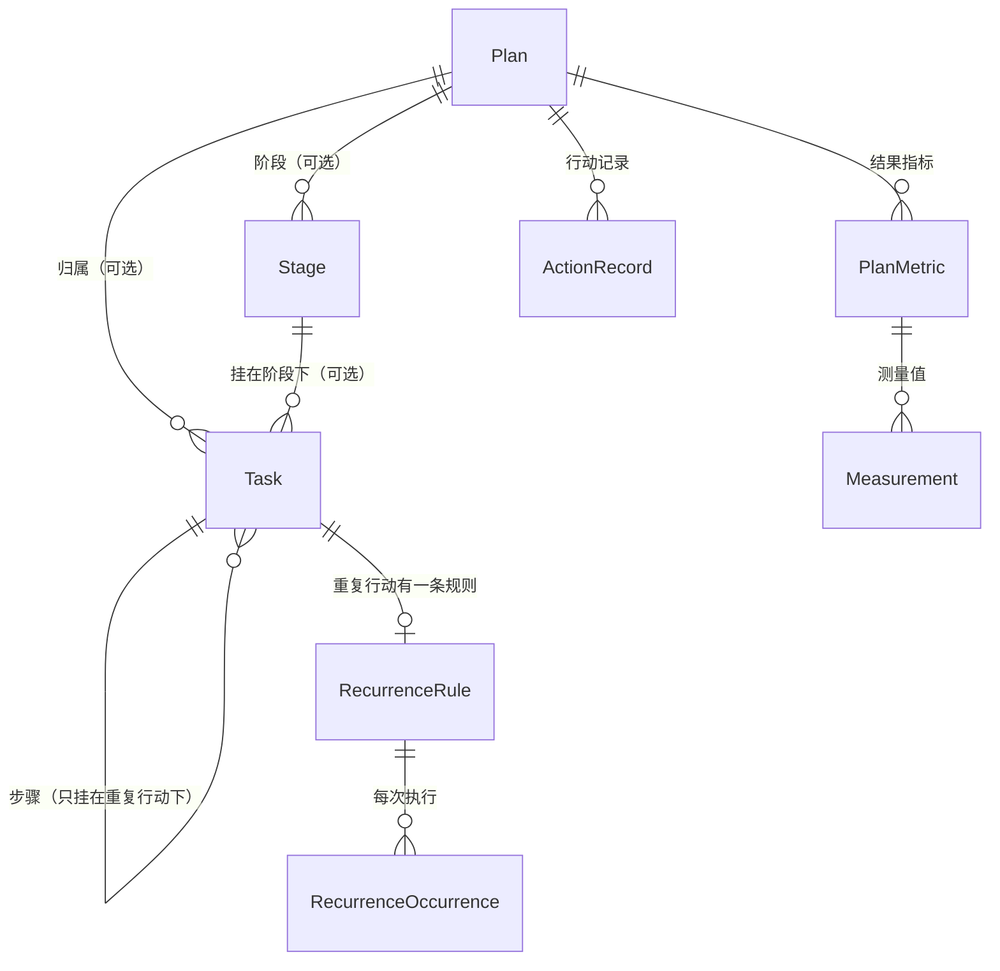

# 概念与关系

本文说明 Movo 当前的对象模型：计划、阶段、任务、重复行动、步骤，以及它们之间的归属、时间、进度和变更规则。字段细节以 `Movo/Domain/Models/` 为准，产品行为以 [PRD](PRD.md) 为准。

## 一张图

## 对象

| 对象 | 是什么 | 要点 |
| --- | --- | --- |
| 计划 `Plan` | 一个目标或长期主题 | 只有名称必填。类型：交付型、改善型、持续型。状态：进行中、已暂停、已归档。「允许云 AI」与「云同步」是两个独立开关 |
| 阶段 `Stage` | 计划内的里程碑 | 可选。属于一个计划，可有起止时间和达成条件。是否达成只由用户确认，AI 不能判断 |
| 任务 `Task` | 一件可执行的事，或组织子任务的分组 | 可以不属于任何计划（独立待办）。状态：待办、进行中、受阻、已完成、已取消 |
| 子任务 | 任务下面的任务 | 多级。仍是 `Task`，通过 `parentId` 指向上级 |
| 重复行动 | 按频率反复发生的任务 | 模板任务（`isTemplate`）加一条 `RecurrenceRule`；每次执行是独立的 `RecurrenceOccurrence` |
| 步骤 | 重复行动每次执行时逐项勾选的清单项 | `isTemplate` 且有上级的 `Task`（`Task.isStep`），可多级 |
| 行动记录 `ActionRecord` | 「做了多少」 | 记录发生时间和时长，不代表完成 |
| 结果指标 / 测量值 | 「结果怎样」 | 指标属于计划，测量值只存实际测到的数，缺测不补 0 |
| 笔记 `Note` | 想法、决定、备忘 | 不产生任务 |

## 归属

- 计划、阶段、子任务层层可选：任务可以直接独立存在，也可以只挂在计划下，或再挂在某个阶段下。
- 任务最多属于一个计划、一个阶段、一个上级。跨目标关联用链接，不复制。
- 阶段必须与任务在同一个计划下。
- **子任务与上级同计划、同阶段**，不能成环。移动一个任务时，整棵子树一起移动。
- 前置关系（`dependencyIDs`）只能指向同一计划内的任务，不能成环。已完成或已取消的前置视为不再阻塞。「受阻」由前置关系派生，不落库。
- 这些规则只在 `StructurePolicy` 里定义，界面和导入都走它。

## 时间

- 计划、阶段、任务都用可选的 `startAt` 与 `endAt`。取值是「某一天」（`DateOnly`）或「某一时刻」（`DateTimeTZ`），两者都不填表示暂存的想法。
- 结束不得早于开始。**子级必须落在上级范围内**：任务 ⊂ 阶段 ⊂ 计划，子任务 ⊂ 上级任务；上级对应一端为空时该端不约束。超出会在保存时被拒绝。
- 没有「定时任务」类型：带某一时刻的开始时间就是定时。重复行动的每天开始、结束时刻保存在规则里。

## 进度与完成

三件事互相独立，不互相推断：

| 操作 | 含义 |
| --- | --- |
| 记录行动 | 投入了时间或做了一部分，不代表完成 |
| 完成任务 | 用户明确标记，不由记录推断 |
| 记录结果 | 测到一个数，不代表目标达成 |

- **交付型**：叶子任务 x/y。上级任务汇总所有后代叶子，不能一次勾选整棵树；已取消的任务和重复行动不计入分母。
- **改善型**：按周期展示重复行动的完成次数，加结果指标趋势，不合成总百分比。
- **持续型**：周期计数，不强制 100%。
- 分母为 0 不显示百分比，缺失的值不填 0。

## 重复行动与步骤

- **模板与实例**：模板任务带一条规则（每天 / 工作日 / 每周几次，生效起止日，可选每天的开始与结束时刻）。每次执行是一个实例，有自己的状态（待做、已完成、已跳过）。
- 完成或跳过某一次，只影响这一次，不改变模板和未来；修改规则只作用于生效日及以后，已发生的记录保持原样。
- **模板下只能挂步骤，不能挂普通子任务**；重复行动本身也不能放在其它待办下面。
- 步骤继承模板的计划与阶段，不单独设置时间、频率和前置，不进入待办列表、计划树、进度和搜索。
- 每次执行的步骤清单保存在实例里：第一次勾选时从模板当前的步骤拍快照，之后修改模板步骤不影响已开始的这一次。实例进度是步骤叶子 x/y，上级步骤由下级汇总；全部勾完后提示「标记本次完成？」，由用户确认。
- **带普通子任务的待办设为重复行动**：设置频率时先预览，确认后未完成的子任务原地转成步骤（时间和前置丢弃），已完成或已取消的子任务移到最近删除，别的待办对它们的前置解除；已结束的子任务下还有未完成子任务时拒绝。转换与设置重复同一批次提交，可撤销。

## 删除、撤销与同步

- 所有业务写入经 `DomainStore` 的命令，一个操作一个批次；批次可整批撤销，撤销是补偿式的：遇到后续编辑会保留并说明。
- 删除只写墓碑，进入最近删除，30 天内可恢复；删除任务会带走整棵子树，恢复只恢复同一次删除的后代。
- 每个实体有 `revision`，同步按字段合并；冲突保留两份由用户选择。计划的「允许云 AI」与「云同步」互相独立。

## 导入与导出

- 导出与导入使用同一种 `.movo.json`（见 [Movo 文件](PlanFile.md)）：计划、阶段、多级任务、重复规则及步骤、独立待办、指标定义；行动记录、测量值、笔记需要用户勾选才导出。
- 导入的每个条目走与手动创建相同的命令和校验，先预览，确认后作为一个批次写入。文件顶层的阶段、指标、任务等可以放进已有计划，待办还可以放在某个未完成的普通待办下作为子任务；默认生成新 id，文件内的外部 id 用来识别重复导入。
