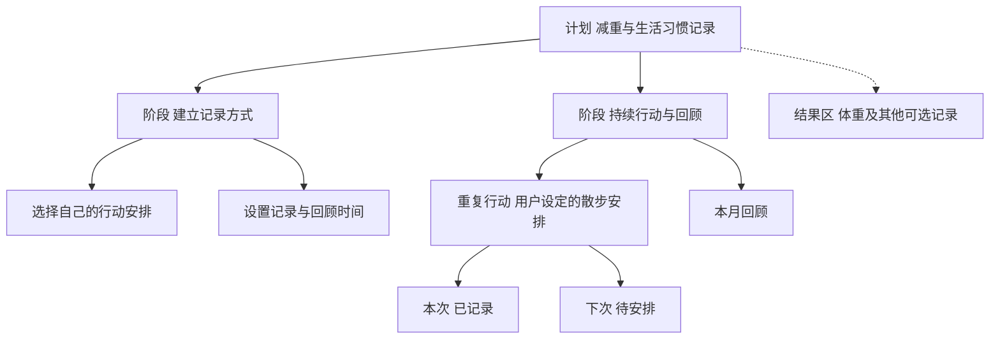

# 个人待办与长期目标产品需求文档

macOS 与 iOS 版本

版本 1.2　日期 2026年9月30日　产品代号 Daily and Beyond

本产品面向需要兼顾日常事务与长期目标的个人用户，帮助用户通过语音或文字快速记录，把每天的行动自动整理到相关计划，并持续看见进展与变化。工作项目、学习考试、减重健身、搬家装修和个人创作都是适用场景。开发者和设计师是使用示例，不构成产品人群边界。

核心体验是“随手记录今天的事，持续推进重要的长期目标”。既允许只记一条买菜提醒，也支持跟进数月的目标。首版打通自然语言输入、自动归类、今日执行、重复行动、结果记录、跨设备同步和长期回顾，阶段结构按需启用。

**本次修订**

2026年9月30日：一级入口调整为“待办”，保留“今日”筛选；手动添加与编辑移到列表内，AI 整理统一文字和语音入口，Mac 提供顶部快捷输入，iPhone 提供底部独立 AI 按钮；支持多级子任务与整棵子树的移动、删除、恢复。

将职业导向调整为通用个人需求；将“项目”升级为可承载工作与生活的“计划”；区分任务完成、持续行动与结果变化；补充健康、学习和生活案例，并同步调整导航、数据模型、MVP 与验收标准。

**阅读导航**

- 产品定位、用户需求和典型场景：第1至2章。
- 对象结构、输入、归类、阶段目标、今日与长期回顾：第3至8章。
- 双端交互、AI、隐私、同步与实现方向：第9至12章。
- 多场景示例、版本范围、验收、研究与参考资料：第13至17章。

## 1 产品定位与范围

### 1.1 要解决的问题

同一个人可能在工作中准备季度汇报，在生活中安排搬家，同时想持续学习英语或改善体重。每天需要完成的事散落在备忘录、聊天、日历和脑海中；长期目标则容易停留在一句愿望，或者因为每日琐事而失去连续性。

产品需要回答：今天要做什么；这件事与哪个长期计划有关；一段时间后做过什么、发生了哪些变化、下一步是否需要调整。一次性事务不要求挂靠长期目标，长期目标也不要求都有明确交付物和结束日期。

### 1.2 首版产品边界

| 维度 | 建议决策 |
| --- | --- |
| 核心用户 | 同时处理日常事务与长期计划的个人用户，覆盖白领、学生及有学习、健康、家庭生活目标的人群 |
| 需求分层 | 交付某个成果、逐步改善某个结果、长期维持某种行动；按需求组织体验，不按职业限定功能 |
| 终端 | 原生 macOS 与 iPhone 应用，共享账号和数据；iPhone 能独立完成全部核心操作 |
| 语言 | 首版中文界面，支持中英文混合、人名地名、日常表达和专业术语 |
| 使用模式 | 单人空间优先，工作、学习、健康和生活作为可选分类，不强制建立复杂目录 |
| 主要价值 | 降低记录与整理成本，将日常行动与长期目标关联，并保留可回看的过程 |
| 首版不纳入 | 团队审批与组织管理、完整文档协作、自动医疗或饮食运动处方、智能体代执行外部事务 |

### 1.3 产品原则

先记下来，再逐步整理。用户只输入一句话即可保存，不需要先学会 Project、Milestone 或依赖图。用户界面优先使用“计划”“阶段目标”“行动”“记录”等日常语言。

同一行动可以出现在今日、计划与回顾中，但只有一份身份。记录能帮助看见进展，不要求每个生活领域都被量化。行为完成与结果达成分别呈现；没有打卡不等于没有行动，也不能因体重等指标短期波动就判断用户失败。

阶段、指标、估时、依赖和成果资料按需显示。AI 尽量减少整理动作，所有推断均可纠正；用户可以暂停计划、跳过当次行动和重新开始，历史保持连续，不制造补打卡或维持连续天数的压力。

### 1.4 Tiimo 参考与本产品方向

Tiimo 官方介绍了语音或文字生成任务、拆解步骤、估时、可视化安排和灵活调整计划等能力。[1][2][3] 本产品借鉴低负担输入与每日安排，并围绕跨月的目标、行动和结果建立持续记录。以下是设计取向对照，不代表对 Tiimo 全部功能的排他性判断。

| 参考维度 | 可借鉴的体验 | 本产品的设计重点 |
| --- | --- | --- |
| 自然语言输入 | 说出或写下要做的事 | 区分任务、重复行动、进展、结果记录和想法 |
| 任务拆解 | 大任务变成可执行步骤 | 按场景选择阶段目标、行动清单或持续频率 |
| 日程可视化 | 看见一天的时间，方便调整 | 同时容纳工作、学习与生活，允许不指定时刻 |
| 灵活回顾 | 整理未完成事项 | 同时查看行动历史、阶段变化和用户记录的结果 |
| 桌面与移动 | 跨设备规划和执行 | Mac 方便整理；iPhone 支持独立使用与随手记录 |

## 2 目标用户与关键场景

### 2.1 按需要而不是职业划分用户

核心人群是希望更轻松地管理日常事务并持续推进重要事情的人。职业、年龄或是否懂项目管理都不作为使用前提；同一用户可能同时拥有以下多种需要。

| 需要 | 典型输入 | 期待的结果 |
| --- | --- | --- |
| 日常事务 | “明天下班买牛奶，周五给快递退货” | 两条独立待办，日期明确，不必新建计划 |
| 工作交付 | “月底前做好季度汇报，这周先收齐各部门数据” | 建立阶段和近期任务，持续关联汇报计划 |
| 学习成长 | “最近准备英语考试，工作日晚上复习，周末做模拟题” | 区分重复复习与阶段测试，记录学习行动和结果 |
| 健康管理 | “我想持续记录减重过程，先把自己的运动安排记下来” | 建立可调整的长期计划，记录行动与用户填写的身体指标 |
| 家庭生活 | “两个月后搬家，先看房，再处理旧家具和地址变更” | 跟进阶段、依赖和完成记录 |
| 专业创作 | “接下来几个月开发 Agent Harness，先做最小运行流程” | 使用更详细的项目结构、成果链接与执行历史 |

### 2.2 端到端体验

首次使用直接提供列表内手动添加，并另设 AI 整理入口，文字与语音共用草稿。用户可以先记一条待办，也可以描述一个长期目标；无需先选择职业、建立项目或填写目标数字。麦克风、通知、日历权限在首次用到时再请求。

早上在待办中查看今日筛选，挑选适合当天的重点行动。白天随手记录工作与生活中的事项，系统建议关联计划。晚上用一句话补记做过的事和新的想法。每周或用户选定的周期，回看行动记录与结果变化，决定继续、调整或暂停。

对以手机为主的用户，建计划、改归属、设重复、填结果、查看树和回顾都能在 iPhone 完成。Mac 是整理大量信息时的便利入口，不是使用长期计划功能的前置条件。

### 2.3 不同深度的使用

轻量用户只需要待办、提醒与简单归类；有长期目标的用户可以启用阶段、重复行动和结果记录；复杂工作计划再展开子任务、依赖和成果资料。功能层级随需要增加，不用一个专业模板覆盖全部场景。

## 3 产品对象与结构规则

### 3.1 核心对象

“计划”是长期事项的统一容器，可以承载有交付日的工作项目，也可以承载学习、健康和生活目标。“目标”描述期望达到的结果，是计划可选的属性；首版不强制增加一层独立目标目录。

| 对象 | 含义 | 示例 |
| --- | --- | --- |
| 计划 Plan | 聚合一段时间内相关行动和记录，可有或没有结束日期 | 季度汇报、英语备考、减重记录、搬家 |
| 阶段目标 Milestone | 可选的中间结果或周期检查点 | 初稿完成、完成第一轮复习、回顾本月记录 |
| 任务 Task | 一次可执行行动，或组织子任务的分组 | 整理销售数据、预约看房、完成一次模拟题 |
| 子任务 Subtask | 一个任务中的具体步骤 | 收集数据、核对口径、整理表格 |
| 每日安排 Day Plan | 某天的任务引用、顺序和可选时间段 | 明晚安排复习任务，不复制原任务 |
| 重复行动 Routine | 按频率持续出现的行动模板与每次执行实例 | 每周回顾、工作日复习、用户自设运动安排 |
| 行动记录 Activity Log | 实际行动、耗时、感受和进展，可不依附预先创建的任务 | 今天复习了半小时；今天完成了搬家打包 |
| 结果指标与记录 Metric 与 Check In | 用户选择记录的结果、单位、时间和来源 | 模拟题成绩、体重、已阅读页数 |
| 调整与成果资料 | 选择原因、文件链接或简短说明 | 调整学习时间的原因、汇报文件、报名信息 |
| 变更事件与快照 | 对象变化和阶段或周期确认时的状态 | 目标日期延后、频率从本周起调整、月度快照 |

工作、学习、生活、健康是可选分类，只用于过滤和整理，不构成必须填写的顶层结构。首版提供少量示例模板，用户可以从空白开始。

### 3.2 结构约束

默认可以只建立“计划 → 任务”，需要时展开“计划 → 阶段目标 → 任务 → 子任务”。阶段目标不必填写，一次性任务支持多级子任务，子任务可以继续分解。只有一条日常待办时无需建立计划。

父任务进度按所有后代叶子汇总，不直接批量勾选后代。删除父任务时预览整棵子树，恢复时只恢复同次删除的后代，不恢复此前已删除的任务。移动或创建后若有新的子任务或编辑，撤销须保留后续修改。

每项行动只有一个主要计划与一个父节点，跨目标关联使用链接，不复制任务或记录。父子任务属于同一计划和阶段；移动分组时子任务随之移动，保留旧位置及时间。依赖关系独立维护，并隐藏在高级操作中。

行动记录与结果记录可以直接关联计划。今天记录体重或者补记一次学习，不需要先创建“记录体重”或“复习”任务。原始数值、单位、发生时间和录入时间分别保存。

重复行动模板可独立存在或挂在计划、阶段下，不能有普通子任务，也不能放在其它待办下面；每次执行有独立身份。模板下可以挂多级步骤（如“背单词”下有“复习旧词”“学新词 → 每组 20 个”），步骤继承模板的计划与阶段，不单独设置时间和频率，也不进入待办列表、进度和搜索。每次执行展开为本次的步骤清单，只记录这一次每个步骤是否完成，不为每天生成真实的任务子树；实例进度为步骤叶子 x/y，上一级步骤由下级汇总；全部完成后提示“标记本次完成？”，由用户确认，不自动完成。第一次勾选时从模板当前的步骤拍一份快照，之后修改模板步骤不影响已开始的这一次。已经带有普通子任务的待办设为重复行动时，先预览再确认：未完成的子任务原地转成步骤（时间和前置关系丢弃），已完成或已取消的子任务移到最近删除，别的待办对它们的前置关系解除；已结束的子任务下还有未完成子任务时拒绝；转换与设置重复同一批次提交，可撤销。树上默认只展示模板与周期摘要，展开后查看实例，避免数月记录把树撑满。结果指标是计划的独立记录区，不作为待勾选子任务。

计划、阶段、任务都用可选的开始时间与结束时间表示时间，取值可以是“某一天”或“某一时刻”，两者都不填表示暂存的想法，之后再补。结束时间不得早于开始时间；子级的时间必须落在父级范围内（计划、阶段、任务、子任务逐级），父级对应一端为空时该端不约束，超出范围的保存会被拒绝，缩小父级时间若会让未完成的下级越界同样被拒绝。重复行动的每天开始、结束时刻保存在重复规则里，每次实例由“实例日期加时刻”生成；规则带开始时刻时按该时刻提醒。没有单独的“定时任务”类型：带某一时刻的开始时间即为定时。

### 3.3 完成与进展的含义

一次性任务状态为待办、进行中、受阻、已完成、已取消；是否安排到今日是独立属性。重复行动的当次实例支持待执行、已完成、已跳过；到了时间仍未操作显示“未记录”，不推断用户一定没有做。

含子任务的分组默认汇总子任务进度；全部完成后可自动显示完成，事件注明由子任务汇总。需要交付确认的计划可以开启手动确认。阶段目标是否达成由用户确认，或者由用户事先设定的明确记录规则判定，不能由 AI 猜测。

| 计划类型 | 默认展示 | 不应混为一谈 |
| --- | --- | --- |
| 交付型 | 交付任务完成数、阶段状态、截止日期和成果 | 完成任务不自动证明成果通过确认 |
| 改善型 | 行动完成情况、结果趋势、周期回顾 | 完成运动安排不等于体重目标已达成 |
| 持续型 | 周期内执行次数、频率、暂停和记录 | 不强制设总进度100%或结束日期 |

交付任务比例只计算未取消的交付叶子任务，重复例行任务不进入分母。重复行动按选定周期展示完成次数、有效计划次数、已跳过与未记录次数；已跳过仍保留在该周期计划次数中，事先暂停或取消的未来实例不计入。分母为0时不显示百分比。

结果指标缺失保持缺失，不填0、不推算成已达标；是否绘制趋势由有效记录决定。用户可以更改目标、频率或阶段，保留生效时间和原版本，不反过来改写过去记录。行动完成率、结果变化和主观感受分别呈现，不合成一个不透明总分。

### 3.4 结果记录的首版范围

REQ 21　允许每个计划添加少量用户自定义数值指标，填写名称、单位、可选目标值、记录时间与备注；支持手动或明确语音录入、纠错与简单趋势。指标完全可选，首版不接入健康设备，不提供预测或医疗建议。

明确说出“今天体重是68.7公斤”时，记录为一次测量；这里的数字只是录入示例，不是产品推荐目标。结果不明确或缺单位时保留原文并询问，不把身高、体重、成绩或时间自动混用。每次更正保留修改事件，删除策略与其他个人数据一致。

## 4 自然语言与语音录入

### 4.1 输入入口与基本流程

手动添加位于筛选栏下面：点击“＋ 添加待办”原地展开，输入标题并回车或点击“添加”，直接保存单条待办，不调用 AI、不先创建原文记录。只有标题必填，可选计划、开始与结束时间、优先级和备注；保存后可连续添加，失败保留输入。子任务在父任务下面添加并继承计划与阶段。全部、即将、未安排视图默认未安排，今日视图默认安排到今天；新事项不符合筛选时给出查看入口。

Mac 顶部仅提供 AI 快捷输入，iPhone 从三个导航标签右侧的独立 AI 按钮进入。文字、录音、转写与处理结果共用一个面板；停止录音只回填草稿，点击“整理并添加”才提交。收起面板保留草稿，处理中的输入可恢复查看。明确的新待办无需关联计划即可自动创建；结果数量只包含实际写入成功的操作。

REQ 01　Mac 提供全局快捷键快速添加、应用内命令面板和粘贴输入；iPhone 提供应用内文字与录音入口。菜单栏快捷入口纳入首版，小组件、分享扩展和 Siri 入口后续增强。

REQ 02　一次输入可以包含多条事项。系统先保存原始文字，再解析意图、动作对象、时间、计划和可选估时。录音先展示转写，用户可改正人名、地名、数字和专有名词。输入正在处理时离开页面，已保存的文字和处理状态仍可恢复。

REQ 03　录音支持开始、停止、取消和中断恢复；首版建议单段最长3分钟，到限时保留已录内容并允许续录。原始音频默认只用于本次转写，完成后清除；转写失败的临时录音经用户选择保留，最长24小时。用户关闭云端语音时，不静默切换上传。

REQ 04　模型输出必须区分“创建任务”“更新已有任务”“记录进展”“记录想法”“记录决定”“记录结果”“设置重复行动”和“查询”。同一段话可以产生多个动作，按原始顺序呈现，保留来源句子。

### 4.2 自动建立与确认规则

明确的新任务可以直接保存，并显示“已添加2项，可撤销”的结果条。AI 补充的估时、优先级和计划判断在任务详情中标记为建议。首版默认允许高把握的计划归类自动写入，不要求用户逐条点确认。

对模糊计划归属，先创建任务并置于待归类，不阻塞记录。对于新建整个计划、批量移动已有任务、取消或删除任务、修改硬截止日期和批量完成，展示一次汇总预览，由用户确认。已有任务的明确单项完成指令，在唯一匹配时可直接执行并支持撤销。

每批操作具有独立标识。重试相同批次不重复建任务；撤销按批次恢复，同时校验期间是否有后续修改。如有冲突，展示可撤销部分和冲突部分，不能覆盖用户后续编辑。

### 4.3 意图解释示例

| 用户输入 | 应产生的行为 | 不应推断的内容 |
| --- | --- | --- |
| “明天整理季度汇报，估计90分钟” | 匹配工作计划并新增或更新任务；明天安排；估时90分钟 | 不把“明天”设为硬截止日期 |
| “今天把报告初稿写完了” | 唯一匹配时完成任务并记录事件；不明确则给候选 | 不新建一条同名未完成任务 |
| “资料整理了一半，还缺销售数据” | 追加进展，保留进行中；提出后续步骤 | 不把“做了一半”自动折算为精确50% |
| “以后也许想学摄影” | 记录为想法，可稍后转为计划 | 不承诺日期，不自动安排每天练习 |
| “下周三之前必须交报告” | 截止日期与任务内容明确呈现 | 不擅自设定当天具体时刻 |
| “今天先不复习，处理一下搬家的事” | 建议调整当日安排，匹配搬家事项 | 不取消整个学习计划 |
| “以后每周读书3次” | 提议一个每周次数型重复模板，采纳后生效 | 不未经确认排定三个固定时刻 |
| “今天体重68.7公斤” | 记录数值、单位、日期和来源，归属不明时留候选 | 不创建一条待完成任务，不推断减重达标 |

### 4.4 时间与语音边界

“明天”“下周”按照输入发生时的设备时区解析，并在结果中显示明确日期。仅有日期的任务保留本地日期语义，带具体时刻的安排保存时区与时间点。跨时区旅行不能让原本的“周五交报告”无提示地变成周四。

“晚点”“有空”“最近”保持未排期或粗粒度时间窗；“每天”需要识别是否真的要求重复执行。中英文混合名词、计划别名、数字、否定词和日期为语音评测重点。无法辨认的专有名词保留原文和疑问标记，不通过猜测改成另一个计划。

## 5 计划自动归类与上下文记忆

### 5.1 归类依据

REQ 05　计划拥有可编辑的上下文：目标、范围、常用表达、别名、当前阶段目标、明确排除项和相关链接。用户在计划内输入时，以当前计划作为默认上下文；明确说出另一个计划时，以明确指令为准。

归类顺序为用户明确指定、当前输入上下文、计划别名和确定性规则、语义候选。只在用户允许的计划范围内检索，不从另一个私密空间引入资料。候选包含未归类和独立事项选项，不强行把所有任务塞进最近使用的计划。不能仅因“散步”就认定是减重任务，也不能仅因“读书”就认定是考试任务；以明确目的、已有上下文和用户规则判断。

### 5.2 自动化与预览确认

AI 整理遵循「先预览，确认后落盘」原则，所有写入操作在真正持久化前都先向用户展示结构化预览（计划、阶段、任务树、起止时间等），不再直接自动写入数据库：

| 场景 | 行为 | 说明 |
| --- | --- | --- |
| 归属已有计划或新建计划 | 在预览中展示计划树结构，待用户确认 | 用户可逐项取消；取消父项级联取消后代 |
| 独立待办或子任务 | 在预览中展示归属层级与起止时间 | 用户确认后作为一个批次一次性写入 |
| 重复任务 | 支持直接建立周期规则与执行步骤 | 重复模板不能有普通子任务，只能挂步骤清单 |
| 无法确定意图或需要补充信息 | 提示补充说明 | 原文完好保留，随时可编辑或重试 |

去掉置信度与分差阈值降级。模型提议什么就在预览中呈现什么，由用户最终确认。确认写入后作为一个原子批次落盘，失败整体回滚；系统支持最近 N 步（默认 5 步）整批撤销，撤销不覆盖后续用户修改。

### 5.3 纠正与学习

REQ 06　任务卡片上可以直接改计划或阶段目标。一次纠正立即生效，并保留原归类理由；是否保存为长期规则由用户选择。系统可以提示“以后提到英语模拟题时也归到备考计划吗”，不把一次操作扩展成全局规则。

修改计划上下文只影响后续建议。对已有未完成任务的重新归类必须先给出变更预览；已完成任务不在后台批量移动。计划归档后默认不接收自动归类，用户明确指定时提示恢复计划或作为历史补记。

### 5.4 长期记忆的内容

计划记忆由当前目标、范围、行动频率、已确认决定、近期进展、可用结果记录和成果资料索引组成，每条摘要回链原始记录。用户可以查看、修改或删除这些记忆。事实记录与 AI 摘要分层保存，修改摘要不会改写真实任务历史。

## 6 长期计划与阶段目标

### 6.1 创建与逐步细化

REQ 07　计划必填项只有名称。描述期望结果、起止时间、类型、分类和结果指标都可后补。用户说“想学英语”时，可以先保存愿望并提出一项近期行动，不自动设定考试、分数和日期。

AI 根据用户目标建议合适的结构：工作交付或搬家可建议少量阶段；学习或健康可建议行动频率与周期回顾；持续维护事项可以完全没有阶段。建议由用户采纳后生效，不强制每个计划都有3至6个 Milestone。

远期保持粗略，当前1至2周按需要细化。任务拆解深度服从用户投入意愿，不默认把整个季度排满。用户可以关闭 AI 建议，仍然使用所有基本结构。

### 6.2 阶段目标与周期检查

REQ 08　阶段目标支持名称、可选达成条件、起止时间、状态和版本。状态为未开始、进行中、待确认、已达成、已暂停、已取消。工作交付场景可使用成果检查清单；改善型计划可以把“完成一次周期回顾”设为检查点，而不是要求身体指标按固定速度变化。

确认阶段时显示相关行动、未完成项、记录和用户选择的结果指标。用户可以将剩余行动后移或调整范围。确认时生成快照，之后的目标变化不修改旧快照；完成一个回顾阶段不等于整体长期目标已经达成。

### 6.3 依赖与调整

REQ 09　高级操作支持计划内前置依赖，例如“确认搬家日期后预约车辆”。禁止自依赖和循环依赖；AI 可以建议先后顺序，普通用户不必维护依赖图。手动提前执行时仅提示关联影响。

风险提示基于可观察事实：临近截止日期、某项长期受阻、近期多次改期或记录不足。持续型目标没有固定截止时，不展示逾期风险。对结果波动只展示已记录变化，不自动解释因果或判断成败。

### 6.4 暂停与恢复

REQ 22　计划可以暂停至指定日期或无限期暂停，暂停期间停止未来的常规提醒和重复实例排入今日，历史保持可查。恢复时从当前日期继续，不批量补建暂停期任务；是否保留已明确设定的硬截止提醒由用户选择。

交付型计划可以完成或归档；持续型计划可长期活跃并按周或月回顾，不要求结项。目标变化是正常调整，界面不把重启计划称为失败。

## 7 今日安排与持续行动

### 7.1 同一个人的工作与生活

REQ 10　今日统一展示工作、学习和生活事项，允许按分类过滤。显示少量重点、固定时间事项、可灵活安排的任务、当日重复行动和完成记录。关联标签可点击，但无归属任务也能正常执行。

可用时间由用户选择是否设置，可以只填晚间空闲或按工作与个人时间分开，不默认每天有4小时自由工作。没有估时的任务不算作0分钟；持续运动、通勤中的学习等场景不强制计时。

REQ 11　AI 根据用户已提供的可用时间、明确优先级、阶段与依赖推荐下一步。工作事项不会因为类型而自动压过生活目标。首版提供可解释的候选与排序，采纳后进入今日；具体时段的复杂自动排程后置。

### 7.2 完成与随手补记

REQ 12　用户可以直接勾选、开始可选计时，或用语音补记。“今天读了20页，明天继续”可以追加行动记录并提出下一步；不要求先建立一条任务才能记录发生的事。计时停止和任务完成分别处理。

记录支持内容、可选耗时、进展、感受、下一步和成果链接。界面使用“记一下进展”，不默认要求工时、证据或交付物。耗时缺失就保持未知，感受字段默认不填写，也不参与用户排名。

### 7.3 重复任务与习惯

REQ 13　未完成的一次性任务可继续、改期、回待办或取消；默认进入待安排，自动顺延由用户开启。重复行动使用模板与独立实例，今天未记录不能让明天出现两份相同任务。更改频率可选择本次或本次及以后，历史不变。

REQ 23　首版支持每日、指定星期和每周指定次数。按次数的行动不强制预定所有时刻，例如“每周读书3次”在周期内显示剩余次数；发生一次只记录一次，通过稳定 ID 去重。完成次数达到设定值后停止当周期剩余次数提示，额外行动仍可记录。

用户可以跳过当次、暂停模板或暂停整个计划。跳过不等于完成，也不等于取消整个目标。反馈使用“本周已记录2次，可再安排1次”等描述，不以连续天数中断或排行榜制造惩罚。

### 7.4 提醒与日历

通知由用户开启，支持开始、截止、选定周期回顾和受阻复查；聚合相近提醒并遵守安静时段。健康等个人事项的锁屏内容默认隐藏详情。双端可分别设置，任一端完成后取消另一端待发提醒；离线时不保证绝对无重复。

日历读取与忙闲避让列为 P1。首版只使用已输入的时间约束，不能假装知道真实会议。日历与健康平台连接都需后续独立评估和授权，不作为首版成立的前提。

## 8 执行树与长期回顾

### 8.1 结构与结果分别可见

REQ 14　计划提供结构树、行动时间线与阶段或周期档案。结构树回答事情如何组织；时间线回答实际做过什么和如何调整；结果记录区回答测量值如何变化。三者通过同一计划关联，但不把结构或同时发生的事件当作因果证据。

树默认折叠重复行动的历史实例，显示当前阶段及周期摘要。选择某个日期范围后，可展开当时实例和记录。没有阶段的计划也可展示任务树；没有结果指标时隐藏指标区，避免空白表盘增加负担。

### 8.2 长期历史

REQ 15　保留创建、拆分、移动、跳过、暂停、恢复、取消、重开、完成、频率调整、目标修改、结果纠错和 AI 撤销等事件。实际发生时间与录入时间分别保存，补记昨天不改写录入时间。

阶段与周期快照记录当时的目标、结构、频率、行动和结果。后续更改目标不覆盖旧目标；更正某次原始记录时标识已更正并保留来源，回顾应指明使用当时快照还是修正后的数据。删除后可在30天内恢复，永久删除仍遵守隐私清理要求。

REQ 16　完成或归档时生成计划档案；持续型计划也可以在不结束的情况下生成月度档案。档案展示目标变化、做过的行动、阶段记录、结果变化、关键调整及成果资料，未记录的信息保持空缺。

### 8.3 回顾应能回答的问题

工作场景可以问“季度汇报为什么延期”；学习场景可以问“这个月复习了哪些内容，成绩有哪些记录”；健康场景可以问“这段时间记录了哪些行动和体重变化”；生活场景可以问“搬家预算和时间什么时候改过”。回答回链原始记录，不从相关性推断某个行动造成了身体或考试结果变化。

REQ 17　每周回顾区分事实、观察和建议。事实分别呈现行动完成情况和结果记录，避免“任务全做完，所以目标已达成”的结论。数据不足时说明记录不足。新建议不自动成为承诺，用户可关闭、调整频率或只手动触发。回顾包含每日行动分布（7天柱状图）与分类精力投入占比条，按实际记录展示，不计算连续打卡天数或施加打卡压力。

### 8.4 导出与可迁移性

REQ 18　支持 Markdown 档案与 Movo 文件（`.movo.json`，结构见 [docs/PlanFile.md](PlanFile.md)）导出，以及 Movo 文件导入。默认只导出结构和计划内容（计划、阶段、任务、重复规则及步骤、独立待办、指标定义），行动记录、测量值、笔记默认不勾选，由用户需要时自己打开；不再按“是否允许云 AI”过滤，文件永不包含 API Key、音频和设备标识。按日期导出时说明范围；源数据为空不填充虚构内容。导入先预览将创建的计划、阶段、任务和不合法的条目，确认后作为一个可撤销的批次写入；默认生成新 id，文件内的外部 id 用于识别重复导入（跳过或另存一份）；校验与手动创建相同，不合法条目在预览中标出而不是静默丢弃；文件带 `schemaVersion`，旧版本可导入，新版本提示升级。设置页提供带字段说明的空模板。归档与持续计划均可导出。

## 9 Mac 与 iPhone 的信息架构

### 9.1 通用导航和术语

一级入口使用待办、收件箱、计划、回顾和搜索。待办内提供全部、今日、即将、未安排筛选和显示已完成开关。今日包含开始于今天或起止范围覆盖今天的事项、逾期事项、已到期的结束时间和进行中事项；即将匹配未来的开始或结束时间；未安排表示没有设置开始和结束时间。筛选保留命中子任务的祖先作为上下文，不复制数据。设置包含账号、同步、AI 与数据、通知和导出。主界面不默认展示 Project、Milestone、Epic、验收、工时等专业术语；“阶段目标”“行动记录”“查看成果”足以表达大部分需要。

| 页面 | Mac 主要操作 | iPhone 主要操作 |
| --- | --- | --- |
| 待办 | 手动添加、日期筛选、折叠任务树、菜单缩进及提升一级 | 手动添加、日期筛选、上级路径、子任务详情与移动 |
| 收件箱 | 批量整理、归类和编辑解析结果 | 快速指定计划，一次确认一批输入 |
| 计划 | 分类过滤，查看阶段、近期行动和可选结果 | 新建与编辑所有类型计划，查看下一步 |
| 计划详情 | 树与详情并排，记录和结果按需切换 | 分层展开树，设重复、填结果、查看趋势 |
| 回顾 | 对照时间线、周期记录和快照 | 阅读与补记，调整下一周期行动 |
| 搜索 | 查找任务、计划、行动记录与成果标题 | 相同检索范围，保留生活和工作上下文 |

### 9.2 Mac 布局

左侧全局导航与计划列表，中间展示待办或选中计划，右侧按需展开详情。需要大量整理时使用树形视图；简单计划默认清单即可。阶段、指标、依赖和成果不在创建时一次展开。

支持键盘新增、完成、搜索、折叠与可改快捷键。跨计划拖动预览影响；快速输入不默认读取其他应用内容。连续行动记录可以筛选为列表，不把桌面界面设计成必须维护的专业管理后台。

### 9.3 iPhone 布局

底部导航为待办、计划、回顾，右侧有独立 AI 按钮；收件箱通过顶部入口进入。手动添加在列表内完成，AI 面板统一文字与语音整理；结果记录提供简短表单，明确数值、单位和日期。用户可在手机独立建计划、设置重复频率、查看树、暂停恢复、纠正记录与导出。

界面验证重点是首次用户能否理解“计划”和“今天”的关系，能否区分“这次做完了”与“整个目标达成了”。不要求用户理解任务依赖或历史快照的实现方式。

### 9.4 可访问性与低压力体验

支持深色模式、系统字号、屏幕阅读器、减少动画及非颜色状态识别。离线、同步中、解析中、待归类和记录失败都使用明确文本。空状态提供日常、工作、学习、健康和生活示例，不默认出现代码或设计任务。

健康记录、感受、照片链接等详情默认不在通知中显示。没有记录时使用中性提示，用户可以隐藏完成率与连续次数，只查看自己需要的信息。

## 10 AI 行为与质量要求

### 10.1 输出契约

AI 每次只生成结构化动作建议，由应用校验后执行。每个动作包含操作类型、目标或临时 ID、字段变更、来源句、依据、待确认字段、置信等级和是否需确认。更新操作必须指定已存在的目标 ID 与版本，不能仅凭任务名称直接写库。

创建类字段包括标题、计划、阶段目标、父任务、开始时间、结束时间、估时、优先级和标签；不确定字段允许为空。重复动作需包含规则与作用范围，结果记录需包含指标、数值、单位与发生时间；没有这些信息不以猜测补齐。应用负责验证计划权限、日期有效性、父子关系、依赖无环、重复操作和输入长度。原始输入中的指令性内容不能绕过这些规则。

### 10.2 自动化权限

| 动作 | 默认策略 |
| --- | --- |
| 保存原始输入与明确新任务 | 自动保存，批次可撤销 |
| 归入明确计划或高把握候选 | 可自动；显示依据与纠正入口 |
| 唯一匹配的单项完成或追加进展 | 按用户明确指令执行，可撤销 |
| 提出子任务或几个月的路线 | 形成建议，采纳后进入正式结构 |
| 批量改动、取消、删除、改硬截止 | 展示影响范围，一次确认 |
| 把叶子任务标记为已完成 | 必须来自用户明确指令或用户启用的后续集成规则；分组可按配置汇总 |
| 记录用户明确提供的结果 | 保存实际数值及来源，歧义字段待确认，不宣告目标达成 |
| 设置重复、暂停恢复、更改目标 | 按明确范围执行；可能影响多个未来实例时展示汇总 |
| 向外部工具写入、发消息、发布 | 首版不支持；后续采用独立授权和预览 |

### 10.3 降级与成本

AI 不可用时仍可手工新增、编辑、归类和完成；文字原文保存在本地，可稍后重试。转写不可用时给出文字入口。超时或部分失败时明确指出哪些已保存、哪些未执行，不用一个成功提示掩盖全部失败。

一次输入先检索有限计划候选和相关任务，再调用模型；避免每次发送数月的全部历史。版本化记录解析策略和模型标识，便于回归。对连续对话设置上下文上限和显式计划边界。成本指标记录单次输入调用数、输入输出量与用户月度消耗，上线前根据真实成本决定额度。

## 11 数据可靠性与隐私

### 11.1 本地优先与同步

REQ 19　文字录入、任务编辑、树浏览、完成和行动记录可离线使用，先持久化本地再提示成功。语音离线能力依语言、设备和系统能力而定，不能作为全设备保证；Apple 文档也要求检查识别及端侧支持情况。[4]

REQ 20　同一账号的 Mac 与 iPhone 增量同步，操作具备客户端生成 ID、版本和幂等标识。行动与结果记录以稳定 ID 追加合并，同一测量的修订保留版本；不同字段尽量合并，同一字段并发修改保留两份候选并提示处理。删除使用删除标记，离线旧设备不能把已删除对象重新创建。

同步失败显示待同步数量并自动重试。登录、退出和换设备须处理本地未同步数据；退出前提醒等待同步或导出。迁移账号和重装不应依赖仅保存在单台设备的密钥或状态。

### 11.2 数据使用选择

本地基础任务功能可在不启用 AI 的情况下完全独立使用。隐私保留全局「AI 开关」；关闭时完全不向外部模型发送网络请求，输入原文完整保存在本地。开启 AI 开关与首次使用 AI 输入时，各向用户展示一次清晰告知：输入原文会原样发给用户配置的模型服务商。

计划级云 AI 开关不再参与请求过滤与判断；API Key 仅通过系统 Keychain 保存在设备本地，永不进入源码、偏好文件、CloudKit、导出或诊断日志。麦克风权限分开请求并解释用途，语音转写保持设备端本地处理。应用诊断日志严格脱敏，不输出任务正文、输入原文、测量值、音频、Key 或厂商请求/响应正文。

### 11.3 数据生命周期

普通删除进入30天回收期；永久删除从在线系统和检索索引中清除，备份清理目标不超过30天，并在产品政策中说明。导出保留来源和结构，允许用户迁移。自动云备份建议每日执行、保留30天；上线前必须演练从备份恢复账号与计划。

## 12 实现方向与数据契约

### 12.1 建议实现方向

建议 macOS 与 iOS 使用 SwiftUI 共享模型和业务规则，同时保留平台独有交互；本地数据库承载离线工作，一个共享服务端负责账号、同步和 AI 调用。服务端可采用团队熟悉的 FastAPI 与关系数据库，首版使用模块化单体，避免为了任务录入引入复杂多智能体平台。

若只做个人 Apple 生态自用版，可评估 iCloud 方案来缩小账号与同步工作量；面向通用个人用户商业化、跨平台扩展和多种第三方连接时，优先评估自有同步服务。两条路线须在工程验证阶段选定，不同时建设两套同步体系。

语音处理和模型提供方使用可替换适配层。Siri、快捷指令等入口可通过 App Intents 评估接入，Apple 官方将其用于向 Siri、Spotlight 与 Shortcuts 暴露应用能力。[5] 首版不依赖这些入口才能完成语音录入。

### 12.2 最小数据实体

| 实体 | 关键字段与关系 |
| --- | --- |
| Plan | ID、名称、期望结果、可选类型与分类、状态、上下文、AI 数据策略 |
| Milestone | 计划 ID、阶段说明、可选达成条件与起止时间、状态、版本 |
| Task | 计划与阶段 ID、父 ID、类型、状态、估时、截止、来源、版本 |
| Plan Entry | 任务 ID、本地计划日期、可选开始与结束时刻、顺序、承诺时间 |
| Activity Log | 计划 ID、可选任务或实例 ID、发生和录入时间、可选耗时、说明、来源 |
| Decision 与 Artifact | 关联对象、说明、选择原因或链接、时间、来源 |
| Activity Event | 对象 ID、操作主体、设备、动作、前后变化、批次、发生与同步时间 |
| Capture 与 AI Proposal | 原始转写、结构化建议、模型版本、采纳状态、幂等标识 |
| Snapshot 与 Routine | 阶段或周期快照；重复规则、频率、暂停区间、时区与实例关系 |
| Metric 与 Check In | 计划 ID、指标名称与单位、可选目标、实际记录值与时间、来源和修订版本 |

### 12.3 必须稳定的契约

所有对象具有稳定 ID；修改名称不改变身份。状态变更与对应事件在一个事务中提交。历史记录采用可追溯变更，不只保存最后一次状态。数值记录保留单位与来源，不同指标不混算；重复实例按模板 ID、周期和实例 ID 去重；目标与频率变更有生效时间，不能改写历史统计口径。耗时只从实际记录累加，与估时分开；取消或移动任务不抹去已发生投入。

AI 解析、建议采纳、任务修改、同步和导出分成独立接口职责。保存操作返回对象 ID、版本与成功或失败状态，支持安全重试。长期回顾通过原始记录加阶段快照实现，首版无需把全部应用设计成复杂事件溯源框架。

## 13 工作与生活的长期计划示例

### 13.1 白领工作交付

计划为“完成季度业务汇报”，示例周期6周，属于交付型。阶段可以是数据收集、分析与初稿、沟通与定稿。用户说“明天下午找销售补一下华东的数据”，系统匹配该计划，建立或更新收集任务，并安排到明天下午；如果同时有两份汇报，先保留待归类。

完成后可回看数据何时收齐、初稿改过几版、哪些问题导致改期，以及最终文件。任务树保留组织结构，时间线保留真实过程。这里不需要 GitHub、设计稿或代码工作流。

### 13.2 减重与生活习惯记录

计划为“持续记录减重与生活习惯”，示例回顾周期为三个月。用户自行决定目标、日常安排和是否记录体重，产品不预设减重速度、饮食数值或运动处方。此案例展示信息组织方式，不构成健康方案。

| 组成 | 用户可设置的内容 | 系统应如何呈现 |
| --- | --- | --- |
| 期望结果 | 用户填写的目标描述，可不填数值 | 与当前记录分开展示，不从行动勾选推断结果 |
| 阶段检查 | 建立记录方式、回顾首月、调整后继续 | 阶段是检查点，不要求每周体重线性下降 |
| 持续行动 | 用户自设散步、运动或其他安排 | 用重复模板与独立实例跟踪，允许暂停和跳过 |
| 实际记录 | “今晚散步40分钟” | 关联当次行动或直接补记，避免再次新建待办 |
| 结果记录 | 用户填写体重及日期，可添加备注 | 独立趋势和单位，缺测留空 |
| 周期回顾 | 本月行动、已记录结果和自己的感受 | 展示事实与变化，不自动判断健康效果或原因 |

同一计划的结构可以如下呈现，结果记录独立于任务树。

实线表示任务归属，虚线表示关联的结果记录区。模板的历史实例默认折叠，选择某月后再查看。记录体重不会自动完成散步任务；完成散步也不会生成一条体重记录。

### 13.3 学习与考试准备

计划为“准备英语考试”。阶段可以是了解要求、复习重点、模拟练习；每天学习或每周练习使用重复行动，报名考试是一次性任务，模拟成绩是结果记录。听课次数和成绩变化分开呈现，未记录成绩的日期不补成0分。

用户说“今天复习了半小时，周末再做套模拟题”，系统记录今天实际行动并创建周末任务。尚未确定考试日期时，不自动生成截止日；改变考试日期时保留历史和对近期安排的影响。

### 13.4 搬家与家庭生活

计划为“两个月后搬家”。看房、确定日期、预约车辆、打包、地址变更是可选阶段或任务，只有必要的事项设置前置依赖。家庭采购和临时提醒可独立存在，不为了整理一个购物清单强行新建长期计划。

搬家结束后保留时间变更、重要事项和资料链接。相似事项再次出现时可复制结构作为新计划，但不把旧完成记录混入新计划进度。

### 13.5 开发与设计作为进阶案例

Agent Harness 仍可作为持续四个月的复杂工作计划：第一阶段跑通基本流程，第二阶段完善可靠执行，第三阶段验证扩展能力，第四阶段试用交付。技术任务可以使用子任务、依赖、运行记录和 PR 链接；这些功能按需展开，不影响普通用户的默认界面。

设计项目可以使用研究、原型、交付阶段，记录方案调整和反馈。OPC 如果表示个人创业，只描述此案例背景，不作为本产品的市场或账号类型限制。两类案例用于验证结构深度，白领、学习、健康与生活案例共同决定首版体验。

### 13.6 一次输入跨越多个生活领域

用户在2026年9月28日说：“明天把季度汇报的数据补齐，晚上按我的计划散步，回家路上买牛奶。今天英语已经复习了半小时，体重也记一下，68.7公斤。”

系统将“明天”解释为2026年9月29日：汇报归入工作计划，散步优先匹配健康计划的当日实例，牛奶保持独立生活待办，英语追加实际行动，体重作为独立结果记录。用户没有明确健康归属时，先保留本地记录与候选；不能因为出现“晚上”就把所有事项归到同一计划。

## 14 MVP 范围与版本节奏

### 14.1 优先级定义

P0 是缺少后无法成立核心体验的首发范围；P1 增强日常使用效率；P2 在验证持续使用价值后评估。MVP 需要纵向打通 Mac、iPhone、AI 输入和长期记录，先控制每项能力的深度，不删除执行树或跨端同步来缩小范围。

| 模块 | P0 首发 | P1 增强 | P2 评估 |
| --- | --- | --- | --- |
| 输入 | 应用内语音与文字、多事项解析、原文与撤销 | 小组件、分享扩展、Siri、快捷指令 | 邮件或会议自动捕获 |
| 归类 | 计划上下文、候选、纠正与用户规则 | 语义检索优化与归类批处理 | 跨工具工作上下文 |
| 计划 | 可选阶段、两层任务、少量工作与生活模板、可选基本依赖、暂停恢复 | 更完整依赖展示和跨计划关联 | 团队空间与权限 |
| 今日与重复行动 | 重点、排序、可选估时、指定日期或每周次数、跳过和暂停 | 日历读取、辅助重排 | 多约束自动排程 |
| 执行 | 开始与完成、可选计时、进展、成果资料链接 | 外部成果资料自动关联 | 智能体代执行 |
| 回顾与结果 | 执行树、实例聚合、周期快照、基础总结、可选数值与简单趋势 | 任意时点回放、更多视图与指标类型 | 外部记录连接 |
| 基础 | 双端同步、离线基础操作、导出与导入、删除恢复 | 更多备份恢复体验 | Windows、Android、Web |

### 14.2 建议开发顺序

第一阶段先完成计划、手工任务、可选阶段、重复行动、树、行动及结果记录，验证交付型和持续型计划在没有 AI 时都能成立。第二阶段接入同步并演练离线并发、删除与恢复；两个终端用相同身份处理同一任务。

第三阶段接入文字解析、归类和批次撤销，再增加语音。第四阶段完善今日、基础回顾和计划导出，用工作交付、学习与健康记录三类真实计划连续试用至少两周，并用模拟跨月事件验证历史。

阶段以通过验收为结束条件，不提供未经团队产能验证的固定开发周数。原生双端、同步和 AI 同时开发的工作量较大；可以先以 Mac 为主工作台迭代，iPhone 首期覆盖录入、今日、计划编辑、重复与结果记录及树浏览，但正式首发仍须满足两端独立完成全部核心操作的要求。

### 14.3 商业化假设

优先验证连续使用和计划回顾价值，再决定收费。可测试基础手工功能与导出长期可用，付费覆盖云 AI 额度、跨端服务及高级回顾的方案；价格需通过访谈和成本测算确定。不以锁住用户历史或禁止导出作为付费手段。

## 15 验收标准与上线门槛

### 15.1 核心功能验收

以下用例是需求验收基线。涉及 AI 的用例应覆盖中文、英文混合、近似计划名、口误和否定表达；固定用例必须与开放试用并行，防止只对测试样例有效。

| 编号 | 场景 | 通过条件 |
| --- | --- | --- |
| AC01 | 一段话包含3件事及一个想法 | 建立3个行动并单独保留想法；原文可查看；重试不重复 |
| AC02 | “明天做”和“明天必须交” | 分别写入计划日期和截止日期；界面能看出差异 |
| AC03 | 语音术语识别错误或来电中断 | 转写可修正；保留已捕获部分；不生成多份任务 |
| AC04 | 两个计划都含整理资料任务 | 无明确线索时保留待归类，展示候选，不任意选一个 |
| AC05 | 用户纠正归属 | 当前任务立即更新；未获允许不批量改历史任务 |
| AC06 | 同一任务连续三天工作 | 任务 ID 不变；每日安排独立；行动记录累积且不重复 |
| AC07 | 子任务、阶段与长期目标完成 | 分组依配置汇总；阶段按明确规则确认；行动完成不等于结果达成 |
| AC08 | 拆分、移动、取消、重开 | 现状正确，历史和原始投入仍可查看，进度不重复计算 |
| AC09 | 非法父子关系及高级依赖校验 | 保存前明确拒绝不合法结构，并保留原输入 |
| AC10 | AI 批次执行后撤销 | 恢复本批次修改；不覆盖批次后发生的其他编辑 |
| AC11 | 断网编辑后两端恢复 | 无记录丢失；相同字段冲突可见；旧设备不复活删除项 |
| AC12 | AI 超时、部分失败或额度耗尽 | 明确成功范围，原文可恢复，手动操作继续可用 |
| AC13 | 每周重复回顾 | 当次完成不完成未来实例；修改范围明确，时区正确 |
| AC14 | 完成计划后重新组织结构 | 已确认快照保持原结构；当前树反映新结构 |
| AC15 | 回顾询问没有记录的原因 | 回答未记录；已有事实均能定位到源任务或事件 |
| AC16 | 全局 AI 开关关闭 | 抓取实际请求验证关闭后 0 网络请求、原文仍完整保存在本机 |
| AC17 | 删除恢复与永久删除 | 回收期可完整恢复；永久删除传播到索引、同步和备份流程 |
| AC18 | 导出跨月计划 | 计划、阶段、任务（含多级子任务、前置关系）、重复规则及步骤、独立待办与源数据一致；勾选后包含行动与结果记录；导出的 `.movo.json` 可被导入还原为同样的结构 |
| AC19 | 减重或学习行动全部勾选 | 不自动标记身体或学习结果达成，结果区只展示实际记录 |
| AC20 | 每周3次行动后暂停一周再恢复 | 次数正确，无重复；暂停期不堆积补做实例；已发生记录不变 |
| AC21 | 语音记录数值或缺少单位 | 明确数值进入结果记录；缺单位先确认；不生成无关待办 |
| AC22 | 调整目标和重复频率 | 新规则从选定时间生效，历史目标、实例和快照可回看 |
| AC23 | 只记买菜或长期维持阅读 | 前者无需计划，后者无需结束日期或强制阶段，均可独立使用 |
| AC24 | 手机独立使用与数据边界 | 可完成计划编辑、重复设置和结果回顾；是否发送只由全局 AI 开关决定，关闭即 0 外发；测量值、行动记录正文与 Key 不进请求体 |

每个核心流程至少同时使用一个工作交付场景和一个持续生活目标验证。健康场景的验收只检查记录与产品行为，不以用户减重数值作为产品功能通过标准。

### 15.2 建议性能与可靠性目标

以下为设计目标，不代表现有测试结果。基准数据为单账号20个计划、1万任务、10万条事件；设备矩阵覆盖所选最低支持系统和一代主流设备，系统版本在技术验证后锁定。

本地新增反馈 P95 不超过300毫秒；今日列表与已有缓存计划首屏 P95 不超过1秒；大计划树首屏 P95 不超过1.5秒，通过按需展开加载。正常网络下双端前台同步可见延迟 P95 不超过5秒；后台遵循系统调度，不作同样承诺。

文字解析在500字且不超过10个动作时，结束输入到结构化结果 P95 不超过8秒；60秒以内录音在停止后15秒内给出结构化结果为初始目标。超过15秒必须给出明确进度或重试入口，不能丢掉原文。以上指标需按网络和模型分组测量。

上线阻断项包括可复现的数据丢失、跨账号泄漏、关闭全局 AI 后仍外发内容、无用户指令完成叶子任务、撤销覆盖后续编辑，以及阶段快照被后续修改污染。

### 15.3 产品验证指标

建议先招募12至20名具有工作、学习、健康和家庭生活需要的个人用户，开发者与设计师仅占其中一部分；观察4周，并选择不同类型计划持续验证8至12周。以下阈值是初始产品假设，小样本应展示人数与分母，不对外宣称统计结论。

| 指标 | 计算与采集口径 | 初始验证目标 |
| --- | --- | --- |
| 首次闭环 | 新用户完成记录与执行；选择长期模式者再建立计划 | 80%试用者在10分钟内完成，无需学习专业术语 |
| 快速输入成功 | 输入后无需改核心意图且被保存的事项占全部可执行输入 | 不低于85%；语音与文字分别看 |
| 自动归类精度 | 人工复核正确的自动归类项占抽样自动归类项 | 不低于95%；同时公布自动处理覆盖率 |
| 纠错成本 | 从发现错误到完成计划或日期纠正的时长 | 中位数不超过10秒 |
| 持续使用 | 分别观察日常待办活跃天数和用户自设周期内的执行或回顾记录 | 按场景建立基线；不要求低频计划每天打卡 |
| 历史可找回 | 回答指定历史问题并定位原始记录的试用者比例 | 不低于80%，每题不超过60秒 |
| AI 回顾可追溯 | 抽样事实陈述具有有效来源且与来源一致的比例 | 不低于98%；关键事实不得凭空生成 |

归类纠正率不能代替准确率，因为用户可能没有发现错误。完成任务数也不能单独代表价值，否则会鼓励拆出大量无意义小任务。优先观察用户是否能持续推进计划，以及几周后是否找得回行动背景。

## 16 风险与待决策事项

### 16.1 主要风险及控制

| 风险 | 产品控制 |
| --- | --- |
| 普通用户觉得像专业项目管理工具 | 默认待办与轻量计划，阶段、依赖和指标按需展开 |
| 场景扩大导致功能失控 | 统一计划、任务、重复行动和记录；不为每种职业独立开发一套产品 |
| 将行动完成率误当成结果达成率 | 分开呈现行动、结果和阶段确认，不计算通用总分 |
| 自动归类误解工作与生活语境 | 保留未归类与独立事项；候选可解释并可纠正 |
| 长期坚持变成打卡压力 | 允许暂停与跳过，恢复不堆积补做任务，反馈中性 |
| 重复实例挤满任务树 | 模板及周期聚合，按需展开历史实例 |
| 记录缺失或指标波动被错误解读 | 缺测不填0，不解释未经证实的因果，不自动判定失败 |
| 双端同步与删除导致数据损坏 | 幂等、版本冲突、删除标记与恢复演练为上线门槛 |
| 健康、家庭和工作信息混入云 AI | 是否发送只由全局 AI 开关决定，关闭即完全本地；日志不采集正文，测量值与行动记录正文不进请求体 |

### 16.2 后续需明确的选择

已经明确的产品方向是面向通用个人需求，支持工作和生活中的日常待办与长期目标；原生 Apple 双端，中文优先，iPhone 可独立使用；自动记录和归类需要可解释、可纠正与可撤销。开发者、设计师和 OPC 不再定义核心人群。

后续需决定自用验证还是公开发布、首发地区与模型服务、最低系统版本，以及日历、小组件和系统快捷入口的开发顺序。健康平台、GitHub 和 Figma 等连接列入特定场景增强，不影响基础需求成立。

### 16.3 首轮用户研究

招募需要管理日常与长期事项的不同用户，优先覆盖白领工作交付、学习成长、健康习惯和家庭事务；开发者和设计师作为其中一部分，不单独主导样本。允许同一人携带两个跨领域计划参与验证。

让参与者完成混合语音录入、纠正归类、建立重复行动、补记实际结果、暂停恢复以及找回一个月前的变化。观察用户是否理解“今天做了”和“长期目标达成”的区别，是否在不学习专业术语的情况下完成操作。

## 17 参考资料

外部资料检索日期为2026年9月28日。引用用于说明参考产品公开能力与平台接口边界；本 PRD 的功能范围、优先级、架构方向和目标数字均为产品设计建议。

[1] Tiimo AI Planning。官方说明 AI 任务拆解、估时、调整计划，并在该页面标明 AI 功能适用于 iOS 与 Web。[Tiimo AI Planning](https://www.tiimoapp.com/product/ai-planning)

[2] Tiimo To Do List。官方说明文字或语音建立任务、优先级整理和跨设备使用。[Tiimo To Do List](https://www.tiimoapp.com/product/to-do-list)

[3] Tiimo Visual Planning。官方说明可视化安排、子任务计时、拖动调整和日终整理。[Tiimo Visual Planning](https://www.tiimoapp.com/product/visual-planning)

[4] Apple Speech。部分语言识别可能需要网络，端侧识别须检查支持能力。[SFSpeechRecognizer](https://developer.apple.com/documentation/speech/sfspeechrecognizer) 和 [端侧识别支持](https://developer.apple.com/documentation/speech/sfspeechrecognizer/supportsondevicerecognition)

[5] Apple App Intents。向系统体验暴露应用动作的官方框架说明。[Apple App Intents](https://developer.apple.com/documentation/AppIntents/app-intents)
